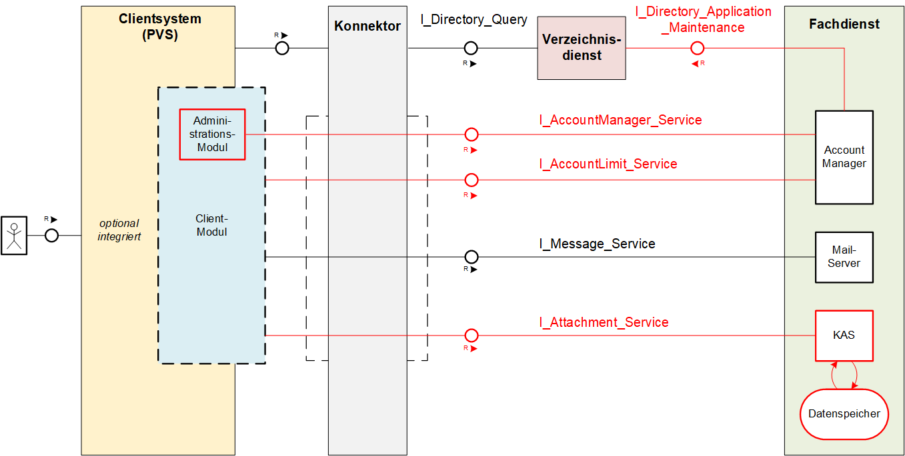

# KIM (Kommunikation im Medizinwesen) - API-Dokumentation

## Allgemeines

Die folgende Dokumentation beschreibt die systemspezifische Lösung von KIM 1.5.1. Es werden insbesondere die Komponenten der Lösung sowie deren Schnittstellen dargestellt und erläutert. Die Version KIM 1.5.1 ist vollständig abwärtskompatibel. Dadurch wird gewährleistet, dass Teilnehmer mit einer früheren Version uneingeschränkt Nachrichten an Teilnehmer versenden können, die bereits KIM 1.5.1 verwenden.

Der Funktionsumfang für KIM 1.5.1 erweitert sich um:

-   die Aufhebung der Größenbeschränkung von Nachrichten

-   die Optionale Integration des Clientmoduls in das Primärsystem

-   ein Administrationsmodul für die Konfiguration des Nutzer-Accounts

-   das Einrichten von Abwesendheitsnotizen

-   die Unterstützung syntaktischer Nachrichtenkategorien

-   die Unterstützung von Multikonnektor-Umgebungen

_Hinweis: Seit März 2020 verwendet die gematik die Bezeichnung „KIM – Kommunikation im Medizinwesen“ für die Anwendung KOM-LE. Diese neue Benennung findet sich insbesondere in Informationsmaterialien für die Zielgruppe Leistungserbringer, sowie in Presseveröffentlichungen. Eine Umbenennung in den technisch-normativen Dokumenten wie Spezifikationen, Konzepten, Zulassungsdokumenten etc. mit Ausnahme von Angaben zu Domänen, E-Mail-Adressen, technischen Schnittstellen, Parametern u.ä. ist aktuell nicht geplant._

## Systemarchitektur

Die folgende Abbildung gibt einen Überblick über die Systemarchitektur von KIM 1.5.1.

[**Clientsystem**](docs/KIM_API.adoc)

-   **Clientmodul:**  
    Das Clientmodul kann jetzt optional in das Clientsystem (z. B. Primärsystem) integriert werden.

-   **Administrationsmodul:**  
    Die Erweiterung des Clientmoduls um das Administrationsmodul ermöglicht die Kommunikation mit dem Account Manager des Fachdienstes zur Administration und Konfiguration des Accounts eines KIM-Teilnehmers.

[**Fachdienst**](docs/Fachdienst.adoc)

-   **Account Manager:**  
    Für die einfache Verwaltung des Accounts sowie das Einrichten von Abwesenheitsnotizen eines KIM-Teilnehmers wird der Account Manager um einen Webservice erweitert. 

-   **KOM-LE Attachment Service:**  
    Der Fachdienst wird um die Komponente KOM-LE Attachment Services (KAS) erweitert, der die sichere Speicherung größerer Anhänge ermöglicht.

[**Basisdienste**](docs/Basisdienste.adoc)

-   **Verzeichnisdienst:**  
    Um die Kompatibilität von KIM 1.5.1 zu früheren Versionen zu gewährleisten, wird der Verzeichnisdienst mit einem neuen Attribut (KOM-LE-Version) erweitert. Weiterhin wird der Verzeichnisdienst um einen zusätzlichen Webservice erweitert. 

## Ordnerstruktur

Im Folgenden ist die Organisation der Ordnerstruktur dargestellt.

    KIM-API
    ├─ docs
    ├─ images
    ├─ samples
    │   ├──── KAS
    │   │    └── MultipleAttachments.zip
    │   └──── SMIME-Profil.zip
    ├─ src
    │   ├──── openapi
    │   │    ├── AccountManager.yaml
    │   │    ├── AttachmentServices.yaml
    │   │    └── DirectoryApplicationMaintenance.yaml
    │   └──── schema
    │        └── Attachment_schema.json
    ├── README.md
    └── ReleaseNotes.md

## Weiterführende Seiten

[- Anwendungsfälle](docs/Anwendungsfaelle.adoc)  

**Produkttypen**  
[- Clientsystem](docs/KIM_API.adoc)  
[- Fachdienst](docs/Fachdienst.adoc)  
[- Verzeichnisdienst](docs/Basisdienste.adoc)    

**Leitfaden für Primärsystemhersteller**  
[- Primärsystem](docs/Primaersystem.adoc)  

**Diverses**  
[- Authentisierung](docs/Authentisierung.adoc)  
[- Versionierung](docs/Versionierung.adoc)  

**Referenz-Implementierungen**  
[- KIM-Attachment-Service](https://github.com/gematik/kim-attachment-service)  
[- KIM-Thunderbird Plugin](https://github.com/gematik/app-thunderbird-kim-plugin)

## Lizenzbedingungen
Copyright (c) 2020 gematik GmbH

Licensed under the Apache License, Version 2.0 (the "License");
you may not use this file except in compliance with the License.
You may obtain a copy of the License at

http://www.apache.org/licenses/LICENSE-2.0

Unless required by applicable law or agreed to in writing, software
distributed under the License is distributed on an "AS IS" BASIS,
WITHOUT WARRANTIES OR CONDITIONS OF ANY KIND, either express or implied.
See the License for the specific language governing permissions and
limitations under the License. 
